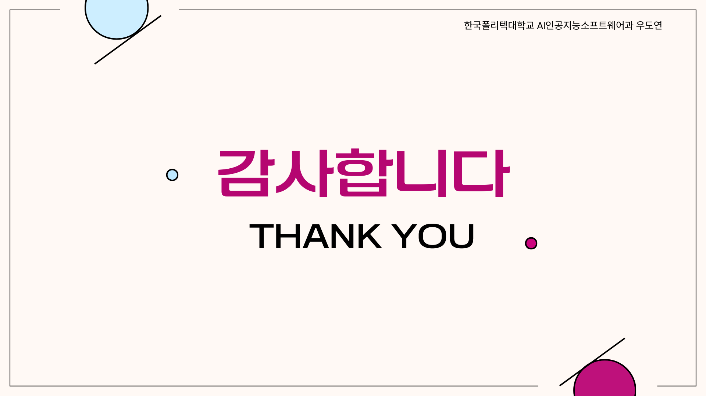

---

# 🛍️ AiwearFit — AI 쇼핑몰 자동화 플랫폼

> **AI + API 기반 자동화**로 상세페이지 제작, 고객 응대, 매출 리포팅, 쇼핑몰 업로드까지 한 번에.  
> **역할:** PM & Full-stack (React/Node/Supabase) · AI/LLM 설계 · 외부 API 통합

---

## ✨ 프로젝트 핵심 가치 (Why AiwearFit?)
- **상세페이지 제작 시간 90% 이상 절감**  
- **이미지/피팅 자동화** (Leonardo · IDM-VTON)  
- **운영 자동화** (정책, 리뷰, FAQ, 챗봇 응대)  
- **쇼핑몰 연동** (Cafe24 API 업로드)  

---

## 🔧 사용 기술 스택
- **Frontend**: React (Vite), TypeScript, TailwindCSS  
- **Backend**: Node.js, Express.js  
- **DB & Auth**: Supabase (PostgreSQL, Storage, Auth)  
- **AI/LLM**: OpenAI GPT, Leonardo AI, IDM-VTON  
- **Commerce API**: Cafe24 API  
- **Deploy/DevOps**: Vercel, Render, GitHub Actions  

---

## 📸 프로젝트 슬라이드 (전체 22장)

### 1. 표지
  
👉 프로젝트 명칭과 발표 표지.

---

### 2. 목차
  
👉 전체 발표 흐름: 개요 → 기술 → 구조 → 기능 → 성과 → 배운 점 → 개선 방향.

---

### 3. 프로젝트 개요
  
👉 소상공인의 상세페이지 제작 비용/시간/전문성 문제를 **AI 자동화**로 해결.

---

### 4. 사용 기술 스택
  
👉 프론트: React, TailwindCSS  
👉 백엔드: Express.js  
👉 DB: Supabase  
👉 AI: GPT, Leonardo, IDM-VTON  
👉 배포: Vercel, Render

---

### 5. 전체 구조
  
👉 **4단계 흐름**  
1) 상세페이지 요청  
2) 관리자 승인  
3) DB 저장  
4) 쇼핑몰 업로드  

---

### (인트로) 핵심 기능 설명
  
👉 **DetailMaker.jsx**: 이미지 합성 + 설명문 자동 생성  
👉 **ChatLogs.jsx**: 고객 응대 자동화 + 감정 분석  

---

### STEP 1. AI 모델 선택
  
👉 기본 모델 이미지 자동 생성.  

---

### STEP 2. 상품 이미지 업로드
  
👉 판매자가 업로드한 상품 이미지 + 모델 합성 준비.  

---

### STEP 3. AI 자동 설명문 작성
  
👉 상품 이미지 기반으로 GPT가 설명문 자동 작성.  

---

### STEP 4. 상세페이지 결과 확인
  
👉 생성된 상세페이지를 미리보기로 확인 가능.  

---

### STEP 5. 관리자 승인 관리
  
👉 운영자가 승인/반려 → 품질 검수 단계.  

---

### STEP 6. 승인 후 쇼핑몰 업로드
  
👉 승인된 페이지를 쇼핑몰에 자동 등록.  

---

### STEP 7. 인공지능 상담 봇
  
👉 GPT 챗봇이 고객 문의에 즉각 응답.  

---

### STEP 8. 고객과 1:1 상담 기능
  
👉 고객과 운영자가 직접 1:1 채팅 가능.  

---

### STEP 9. 1:1 상담 중 AI 어시스턴트 조언
  
👉 운영자에게 **적절한 답변 초안** 추천.  

---


### 🚀 배포(라이브)

<p align="center">
  <a href="https://ai-shop-automation-project.vercel.app/" target="_blank" style="text-decoration:none;">
    <kbd style="padding:12px 18px; font-size:16px; background:#000; color:#fff; border-radius:8px;">
      🔥 AiwearFit (Vercel) — 바로 열기
    </kbd>
  </a>
</p>

> **Tip**  
> - 로컬 파일 경로(`./AiwearFit.pdf`, `./video1.mp4`, `./video2.mp4`)가 리포지토리 최상위에 위치해야 위 링크가 정상 동작합니다.  
> - 다른 폴더에 있다면 링크 경로만 맞게 변경해주세요.

### STEP 10. 배포
  
👉 Vercel(프론트), Render(백엔드)로 배포 완료.  

---

### 🎬 시연 영상 상세

<details>
<summary><b>▶ Video 1 — 기본 기능 데모 (클릭하여 열기)</b></summary>

**재생 흐름**
1) 로그인  
2) AI 모델 생성  
3) 상품 이미지 업로드  
4) AI 피팅 이미지 생성  
5) 상품 설명문 자동 생성  
6) 관리자 승인 요청  
7) 관리자 승인 후 쇼핑몰 자동 업로드  
8) “나의 상세페이지”에서 업로드 확인

**파일**: [`./video1.mp4`](./video1.mp4)
</details>

<details>
<summary><b>▶ Video 2 — Cafe24 연동 & 자동 업로드 (클릭하여 열기)</b></summary>

**추천 시청 구간**: **0:01:14 ~ 0:02:51**  
**하이라이트**
- Cafe24 API로 상품 등록/수정 자동 업로드
- 쇼핑몰 **AI 챗봇** 실시간 응답 시연(문의 → 톤/템플릿 추천 → 구매 유도)

**파일**: [`./video2.mp4`](./video2.mp4)
</details>

### 🎬 시연 영상
  
👉 로그인 → 모델 생성 → 상품 업로드 → 상세페이지 생성 → 승인 → 업로드까지 전체 과정 시연.  

---

### 어려웠던 점
  
👉 보안/구조 설계 미숙, 반복 수정으로 시간 지연.  

---

### 배운 점 (1)
  
👉 초기 구조 설계 중요성, 네이밍/파일 정리 습관, 직관적 UI 설계.  

---

### 배운 점 (2)
  
👉 간결한 코드, 버전 관리, 기술 스택 선택의 중요성.  

---

### 향후 개선 방향
  
👉 UI/UX 고도화, 테스트 코드 도입, 전체 리팩토링.  

---

### 마무리
  

---

## 🗂️ 폴더 구조
```

aiwearfit/
├─ client/                # React (Vite) 프론트엔드
│  ├─ src/components/     # 템플릿/공용 컴포넌트
│  ├─ src/pages/          # PromptCreate, PromptEditor, Dashboard
│  └─ ...
├─ server/                # Express 백엔드
│  ├─ routes/ai/          # 설명/리뷰/정책 API
│  ├─ routes/images/      # VTON(피팅) 연동
│  ├─ routes/commerce/    # Cafe24 API 업로드
│  └─ ...
└─ images/                # 발표 슬라이드 (1.png \~ 22.png)

````

---

## 🚀 실행 방법

### 1) 환경 변수
- `server/.env`와 `client/.env`를 프로젝트 루트에 작성

### 2) 설치 & 실행
```bash
# 서버
cd server && npm install && npm run dev

# 클라이언트
cd client && npm install && npm run dev
````

* 프론트: [http://localhost:5173](http://localhost:5173)
* 백엔드: [http://localhost:8080](http://localhost:8080)

---

### 🗂️ 자료 모아보기

| 구분 | 파일 | 내용 요약 |
|---|---|---|
| 📄 Tech Report | [`AiwearFit.pdf`](./AiwearFit.pdf) | 프로젝트 개요, 아키텍처, 핵심 기능, 성과, 개선 방향 일괄 정리 |
| 🎞️ Demo Video 1 | [`video1.mp4`](./video1.mp4) | **기본 기능**: 로그인 → 모델 생성 → 상품 업로드 → AI 피팅 → 설명문 생성 → 승인 요청 → 자동 업로드 → “나의 상세페이지” 확인 |
| 🎞️ Demo Video 2 | [`video2.mp4`](./video2.mp4) | **Cafe24 연동 데모** + **AI 챗봇 응대 시연** *(추천 구간: 0:01:14 ~ 0:02:51)* |
| 🚀 Live | Vercel 배포 | https://ai-shop-automation-project.vercel.app/ |

---

## 👤 담당 & 연락

**우도연 (PM & Full-stack Developer)**

* GitHub: [@woodoyeon](https://github.com/woodoyeon)
* Blog: [https://upwardtrend.tistory.com/](https://upwardtrend.tistory.com/)
* Email: [dydy1212qwqw@naver.com](mailto:dydy1212qwqw@naver.com)

---

## 📄 라이선스

이 저장소의 소스/리소스는 별도 고지 없이는 **상업적 사용 제한**이 있습니다.
회사/학술 목적 활용 시 문의 바랍니다.
