---


# 🛍️ AiwearFit — AI 쇼핑몰 자동화 플랫폼

> **AI + API 기반 자동화**로 상세페이지 제작, 고객 응대, 매출 리포팅, 쇼핑몰 업로드까지 한 번에.  
> **역할:** PM & Full-stack (React/Node/Supabase) · AI/LLM 설계 · 외부 API 통합

---

## ✨ 핵심 가치 제안 (Why AiwearFit?)

* **상세페이지 제작 시간 90%+ 단축**: GPT 프롬프트 + 템플릿 렌더링  
* **이미지·피팅 자동화**: Leonardo / IDM-VTON으로 모델·의상 합성  
* **운영 자동화**: 챗봇 응대, 정책/리뷰/FAQ 자동 작성  
* **D2C/오픈마켓 연동**: Cafe24 API 업로드 파이프라인  

---

## 📸 프로젝트 전체 슬라이드

### 1. 표지
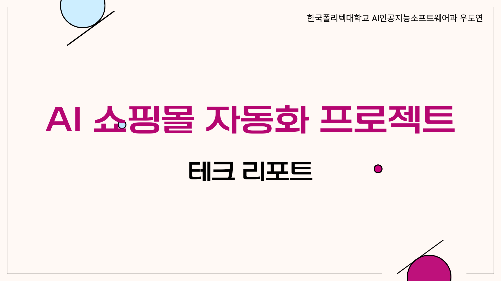

### 2. 목차
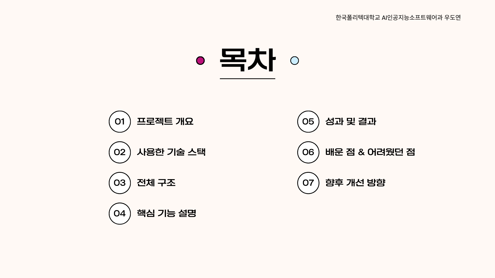

### 3. 프로젝트 개요
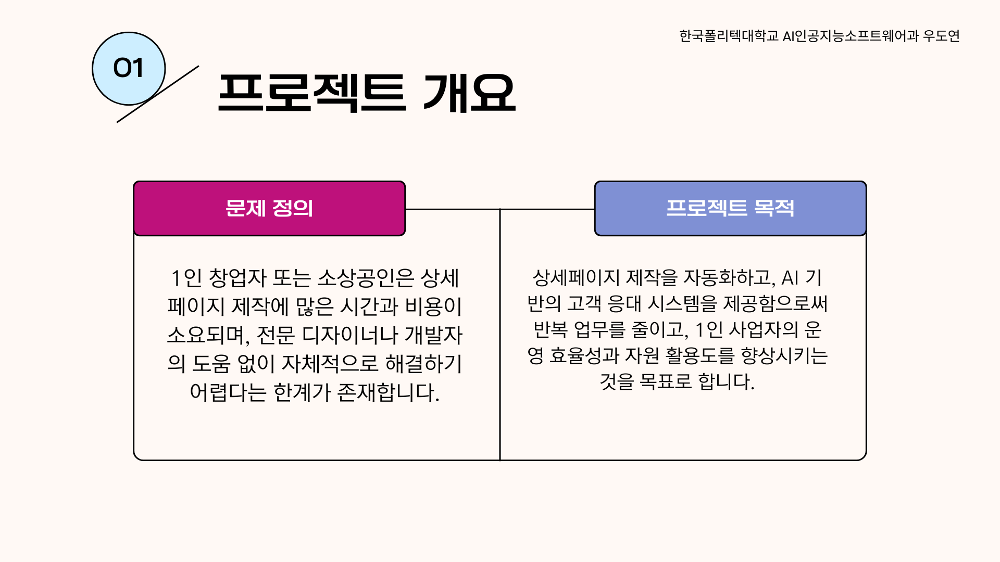

### 4. 사용 기술 스택


### 5. 전체 구조
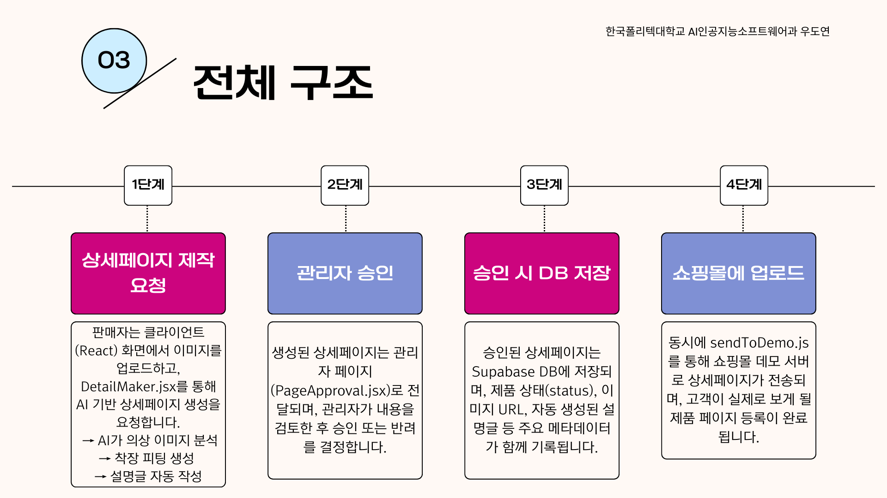

---

## 🔧 기술 스택
* **Frontend**: React (Vite), TypeScript, TailwindCSS  
* **Backend**: Node.js, Express.js  
* **DB & Auth**: Supabase (PostgreSQL, Storage, Auth)  
* **AI/LLM**: OpenAI GPT, Leonardo AI, IDM-VTON  
* **Commerce API**: Cafe24 API  
* **Deploy/DevOps**: Vercel(프론트), Render(백엔드), GitHub Actions  

---

## 🧩 주요 기능 (슬라이드 기반)

### STEP 1. AI 모델 선택
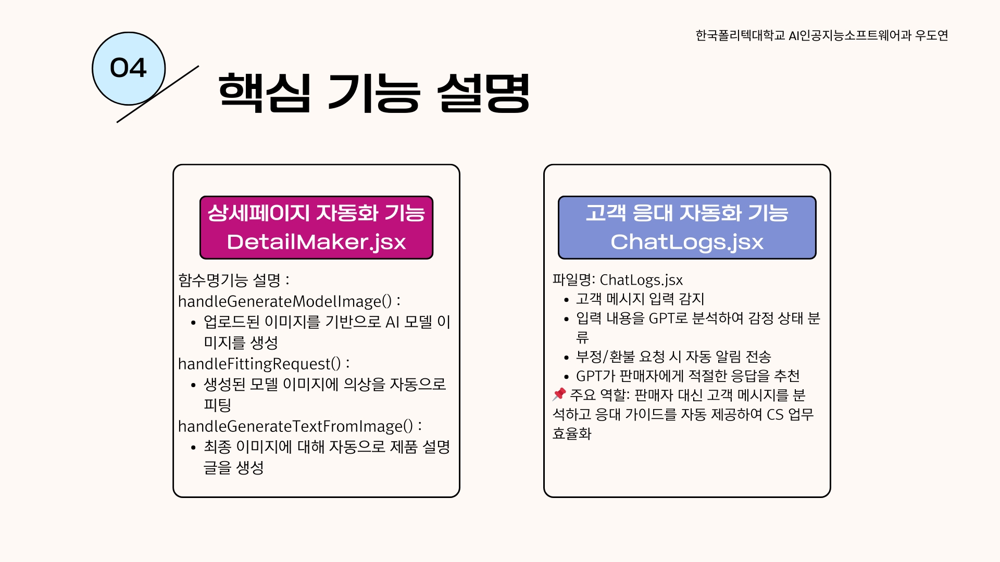

### STEP 2. 상품 이미지 업로드
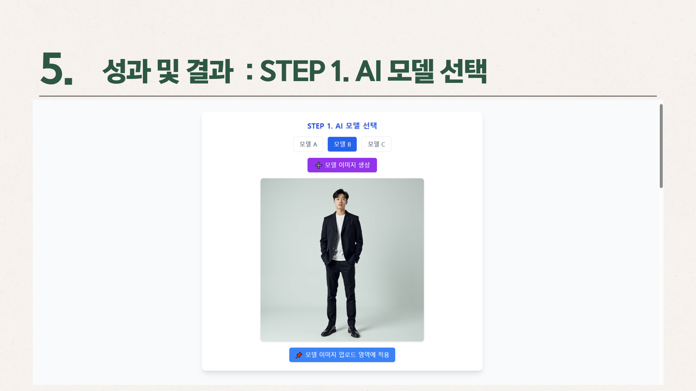

### STEP 3. AI 자동 설명문 작성
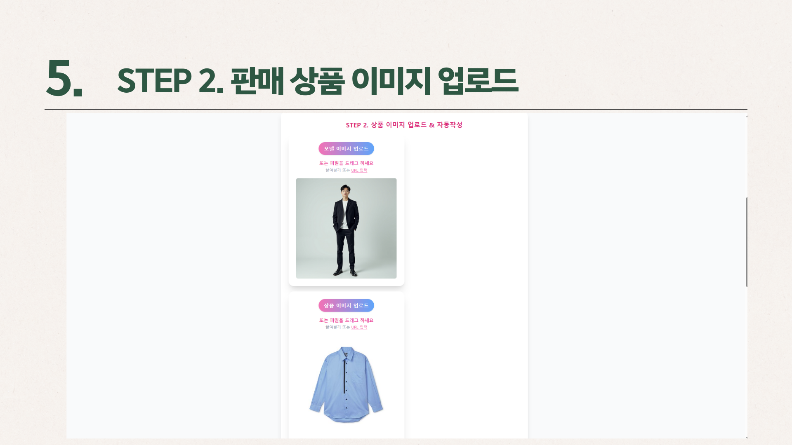

### STEP 4. 상세페이지 결과 확인
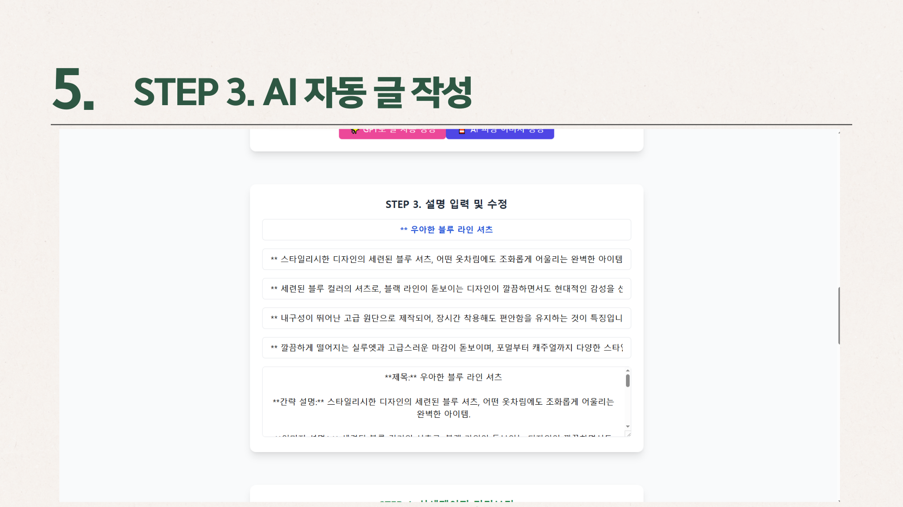

### STEP 5. 관리자 승인 관리
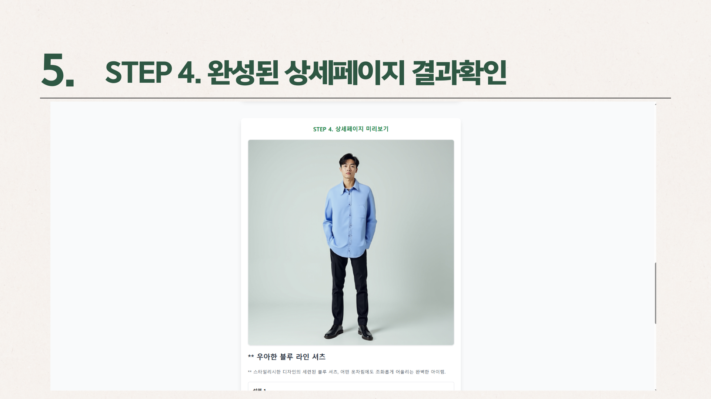

### STEP 6. 승인 후 쇼핑몰 업로드
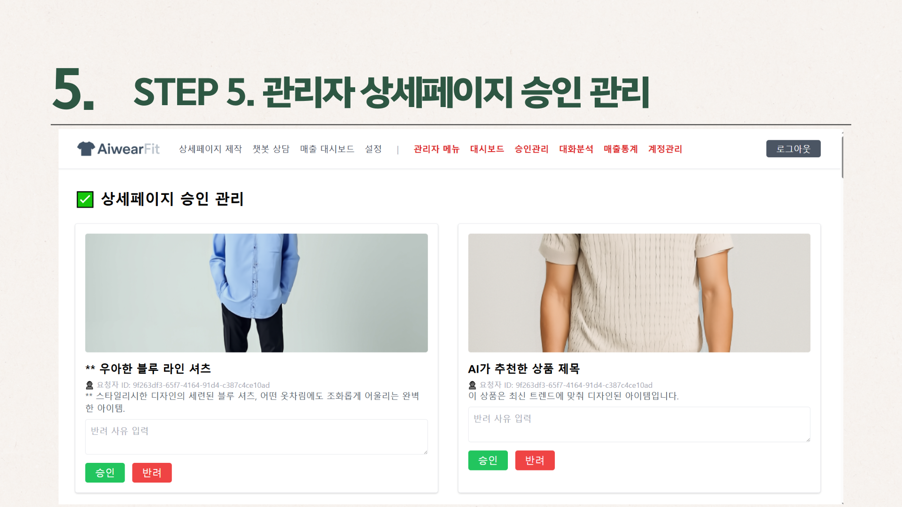

### STEP 7. 인공지능 상담 봇
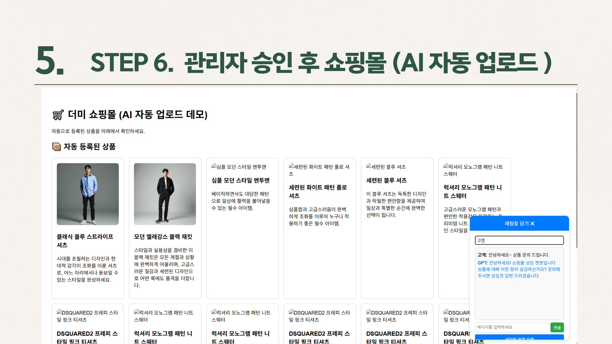

### STEP 8. 고객과 1:1 상담 기능


### STEP 9. 상담 중 AI 어시스턴트 조언
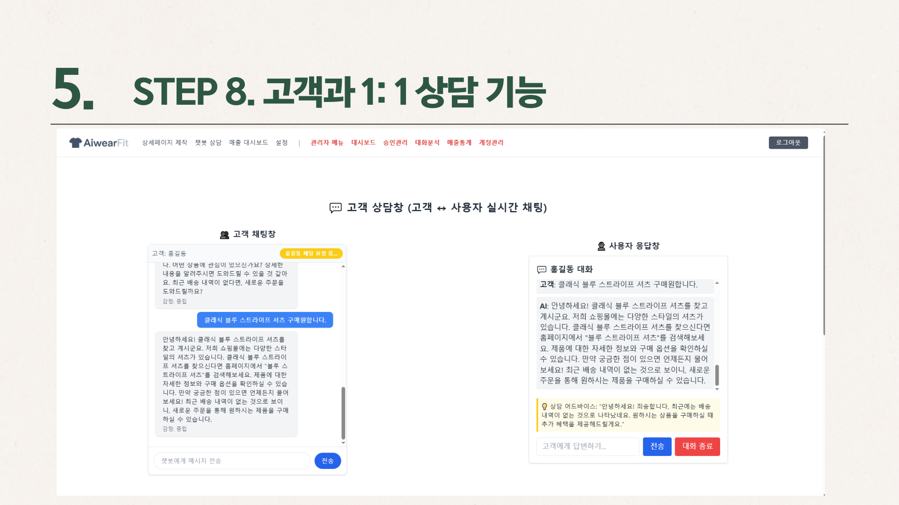

### STEP 10. 배포
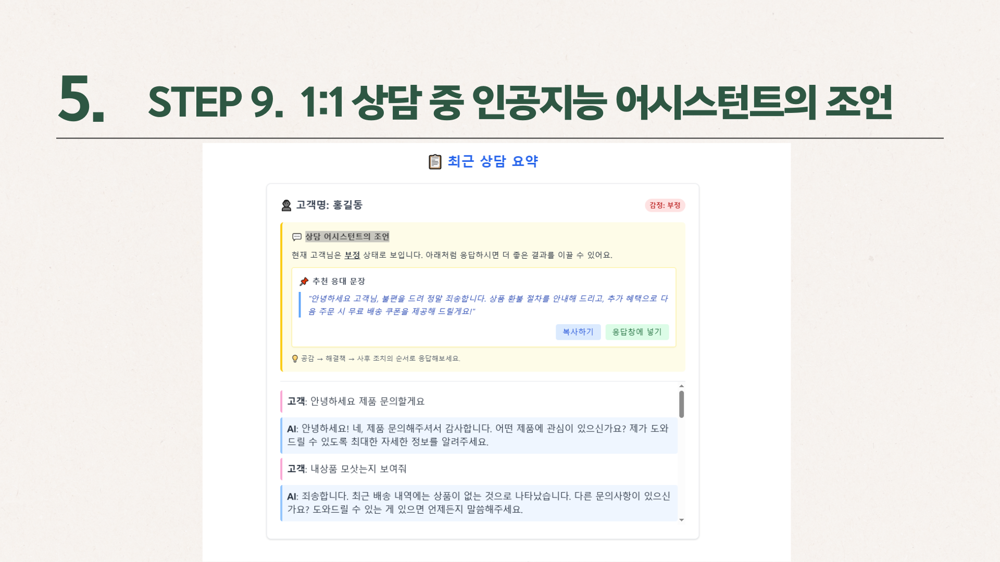

---

## 🎬 시연 영상
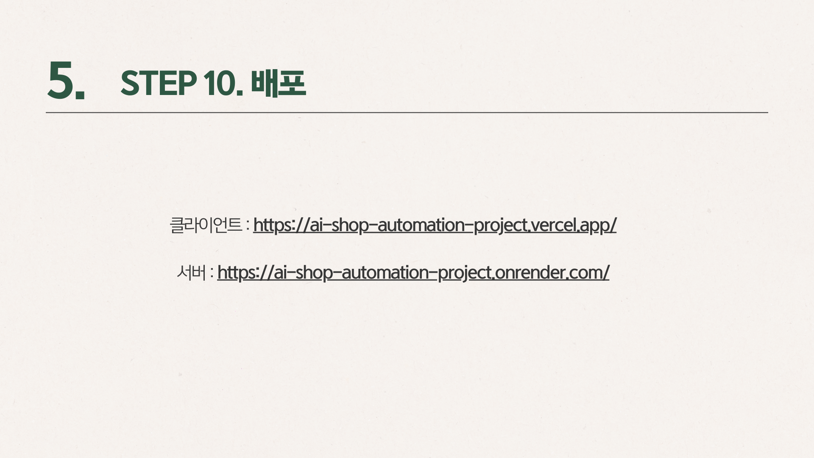

---

## 📑 배운 점 & 어려웠던 점

### 어려웠던 점


### 배운 점 (1)
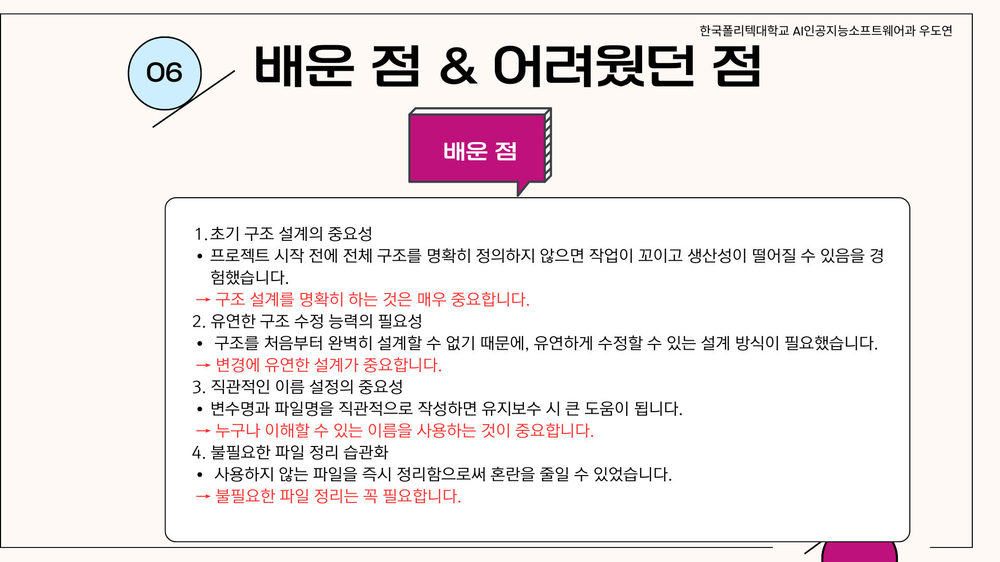

### 배운 점 (2)
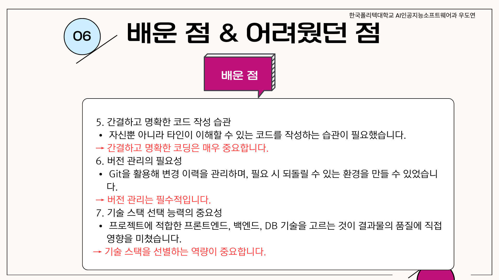

---

## 🚀 향후 개선 방향
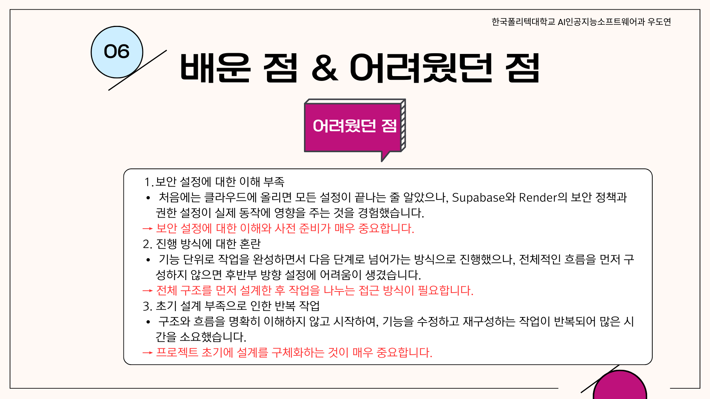

---

## 🙏 마무리
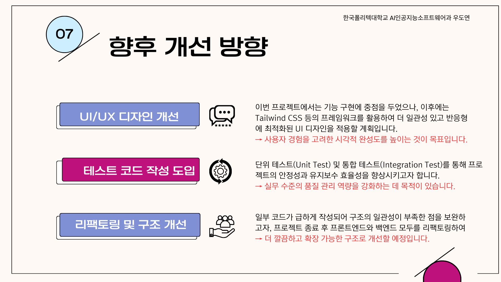

---

## 🗂️ 폴더 구조

```

aiwearfit/
├─ client/                # React (Vite) 프론트엔드
│  ├─ src/components/     # 템플릿 컴포넌트
│  ├─ src/pages/          # PromptCreate, PromptEditor, Dashboard
│  └─ ...
├─ server/                # Express 백엔드
│  ├─ routes/ai/          # AI 기능 (설명, 리뷰, 정책)
│  ├─ routes/images/      # VTON 연동
│  ├─ routes/commerce/    # Cafe24 API 연동
│  └─ ...
└─ images/                # 발표 슬라이드 (1.png \~ 22.png)

```

---

## 📑 프로젝트 자료

- 📄 [테크 리포트 PDF](./AiwearFit.pdf)  
- 🎬 [시연 영상](./video1.mp4)  

---

## 👤 담당 & 연락

**우도연 (PM & Full-stack Developer)**  
- GitHub: [@woodoyeon](https://github.com/woodoyeon)  
- Blog: [https://upwardtrend.tistory.com/](https://upwardtrend.tistory.com/)  
- Email: [dydy1212qwqw@naver.com](mailto:dydy1212qwqw@naver.com)  

---

## 📄 라이선스
이 저장소의 소스/리소스는 별도 고지 없이는 상업적 사용을 제한할 수 있습니다.  
회사/학술 과제 등 활용 시 문의해주세요.
```
