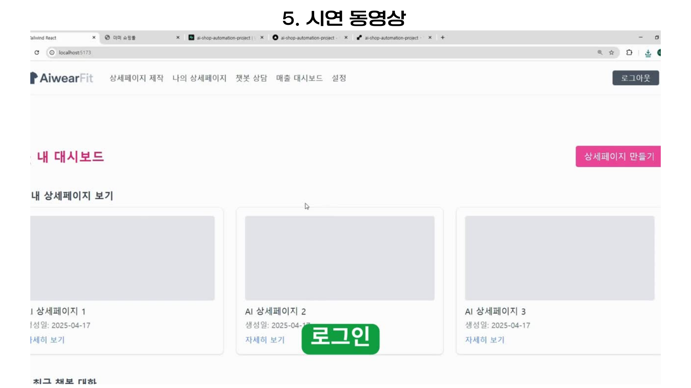

---


# 🛍️ AiwearFit — AI 쇼핑몰 자동화 플랫폼

> **AI + API 기반 자동화**로 상세페이지 제작, 고객 응대, 매출 리포팅, 쇼핑몰 업로드까지 한 번에.  
> **역할:** PM & Full-stack (React/Node/Supabase) · AI/LLM 설계 · 외부 API 통합

---

## ✨ 핵심 가치 제안 (Why AiwearFit?)

* **상세페이지 제작 시간 90%+ 단축**: GPT 프롬프트 + 템플릿 렌더링  
* **이미지·피팅 자동화**: Leonardo / IDM-VTON으로 모델·의상 합성  
* **운영 자동화**: 챗봇 응대, 정책/리뷰/FAQ 자동 작성  
* **D2C/오픈마켓 연동**: Cafe24 API 업로드 파이프라인  


---

## 🧩 주요 기능 (슬라이드 기반)

> 아래부터가 이미지/설명 불일치가 나던 구간입니다.  
> **6.png(핵심 기능 설명)**을 먼저 넣고, **Step 1은 7.png부터** 시작하도록 정렬했습니다.

### (인트로) 핵심 기능 설명

- **DetailMaker.jsx**: 모델 이미지 생성 → 의상 자동 피팅 → 상품 설명 자동 생성  
- **ChatLogs.jsx**: 고객 메시지 분석·감정 파악 → 응답 초안 추천·알림 전송

### STEP 1. AI 모델 선택

- 원하는 AI 모델을 선택해 **기본 모델 이미지**를 생성합니다.

### STEP 2. 상품 이미지 업로드

- 판매자가 **의상/상품 이미지**를 업로드하면 합성 준비가 됩니다.

### STEP 3. AI 자동 설명문 작성

- 이미지/카테고리/키워드 기반으로 **상품 설명문**을 자동 생성·수정합니다.

### STEP 4. 상세페이지 결과 확인

- 합성 이미지 + 설명이 적용된 **상세페이지 미리보기**를 검토합니다.

### STEP 5. 관리자 승인 관리

- 운영자가 상세페이지를 **승인/반려**하여 품질을 보증합니다.

### STEP 6. 승인 후 쇼핑몰 업로드

- 승인된 항목은 **쇼핑몰에 자동 등록**되어 즉시 노출됩니다.

### STEP 7. 인공지능 상담 봇

- GPT 챗봇이 문의에 답하고, **구매 유도 문구**를 제안합니다.

### STEP 8. 고객과 1:1 상담 기능

- 관리자가 고객과 **실시간 채팅**으로 세부 문의를 처리합니다.

### STEP 9. 1:1 상담 중 AI 어시스턴트의 조언

- 고객 감정/상황을 분석하여 **응답 초안·다음 액션**을 추천합니다.

### STEP 10. 배포

- 프론트: **Vercel**, 백엔드: **Render**, 링크를 통해 바로 접속 가능

---

## 🎬 시연 영상(데모)

- 로그인 → 모델 생성 → 상품 업로드 → 피팅 생성 → 설명문 생성 → 승인 → 자동 업로드 → 결과 확인까지 **엔드-투-엔드** 흐름 시연

---

## 📚 배운 점 & 어려웠던 점

### 어려웠던 점

- 보안 설정 이해 부족, 전체 구조 먼저 설계하지 않아 생긴 **재작업/비효율**

### 배운 점(1)

- 초기 구조 설계의 중요성 / 유연한 설계 / **직관적 네이밍** / 파일 정리 습관

### 배운 점(2)

- **간결한 코드** / **버전 관리 필수** / **기술 스택 선택 역량**의 중요성

---

## 🚀 향후 개선 방향

- **UI/UX 개선**: 반응형·일관성 높은 디자인 적용  
- **테스트 코드 도입**: Unit/Integration Test로 안정성 향상  
- **리팩토링**: 깔끔하고 확장 가능한 구조로 개선

---

## 🙏 마무리


---

## 🗂️ 폴더 구조

```

aiwearfit/
├─ client/                # React (Vite) 프론트엔드
│  ├─ src/components/     # 템플릿 컴포넌트
│  ├─ src/pages/          # PromptCreate, PromptEditor, Dashboard
│  └─ ...
├─ server/                # Express 백엔드
│  ├─ routes/ai/          # AI 기능 (설명, 리뷰, 정책)
│  ├─ routes/images/      # VTON 연동
│  ├─ routes/commerce/    # Cafe24 API 연동
│  └─ ...
└─ images/                # 발표 슬라이드 (1.png \~ 22.png)

```

---

## 📑 프로젝트 자료

- 📄 [테크 리포트 PDF](./AiwearFit.pdf)
  (프로젝트 개요, 아키텍처, 주요 기능, 성과 정리)

- 🎬 시연 영상
  - [Video1 — 기본 기능 데모](./video1.mp4)
    
  1. 로그인  
  2. 모델 생성  
  3. 상품 이미지 업로드  
  4. AI 피팅 이미지 생성  
  5. 상품 설명문 자동 생성  
  6. 관리자 승인 요청  
  7. 관리자 승인 후 쇼핑몰 자동 업로드  
  8. “나의 상세페이지”에서 업로드 확인  

    
  - [Video2 — Cafe24 연동 & 자동 업로드 데모](./video2.mp4)
    
  - 구간: **0:01:14 ~ 0:02:51**  
  - 기능: AI 챗봇 개발 및 응답 시연  
  
---

## 👤 담당 & 연락

**우도연 (PM & Full-stack Developer)**  
- GitHub: [@woodoyeon](https://github.com/woodoyeon)  
- Blog: [https://upwardtrend.tistory.com/](https://upwardtrend.tistory.com/)  
- Email: [dydy1212qwqw@naver.com](mailto:dydy1212qwqw@naver.com)  

---

## 📄 라이선스
이 저장소의 소스/리소스는 별도 고지 없이는 상업적 사용을 제한할 수 있습니다.  
회사/학술 과제 등 활용 시 문의해주세요.
```
